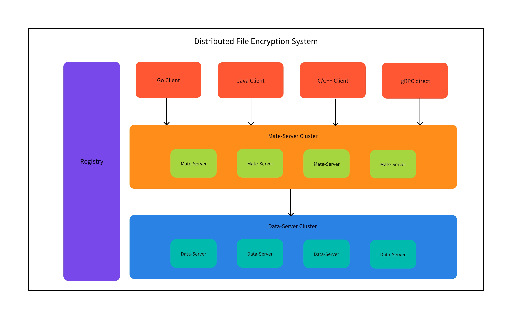

Distributed File Encryption System
==================================

Distributed file encryption system implement by golang.

DFES is a distributed system using the following component to implement:
1. [Protocol buff](https://github.com/protocolbuffers/protobuf)
2. [gRPC](https://github.com/grpc/grpc)
3. [Raft](https://github.com/hashicorp/raft)
4. Asymmetric/Symmetric encryption
5. [LRU cache](https://github.com/hashicorp/golang-lru)

Feature
-------
1. Distributed system, High availability.
2. Mate-Server through raft protocol implement CP architecture.
3. Data-Server through Quorum NRW implement AP architecture.
4. Using Registry-Center manager all server information.
5. Using gRPC implement the communication among services.
6. Using one fragment with multiple replicas which is distributed in different machines to implement high availability.

Quick start
-----------
1. Using go mod tidy to install go dependencies.
    ```shell
    go mod tidy
    ```
2. Start **Registry-Center** in a terminal window.
   ```shell
   go run cmd/registry/main.go 
   ```
3. Start **Leader** **Mate-Server** in a terminal window
    ```shell
    go run cmd/mate-server/main.go -port 7001 -server-name mate-node-1 -raft-addr "127.0.0.1:9001" -leader-addr ""
    ```
4. Start **Follower** **Mater-Server** in other terminal window (optional)
    ```shell
    go run cmd/mate-server/main.go -port 7002 -server-name mate-node-2 -raft-addr "127.0.0.1:9002" -leader-addr "127.0.0.1:7001"
    go run cmd/mate-server/main.go -port 7003 -server-name mate-node-3 -raft-addr "127.0.0.1:9003" -leader-addr "127.0.0.1:7001"
    ```
5. Start **Data-Server** in other terminal window
    ```shell
    go run cmd/data-server/main.go -port 8001 -server-name "data-node-1"
    go run cmd/data-server/main.go -port 8002 -server-name "data-node-2"
    go run cmd/data-server/main.go -port 8003 -server-name "data-node-3"
    ```
6. Test your server, you can use the given example in cmd/test-*, have fun.

Structure
---------
Firstly there is the bird's-eye view of the whole structure:


We can see that the whole system contains four main objects:

1. Different programing language Client which can send requests to Mate-Server.
2. Mate-Server cluster contains many Mate-Nodes. There will hava a Leader node in the Cluster.
   - Mate-Server was used as the store of the meta-information of the file. It will store the fragment information of the file, such as how many fragments the file have, how many replicas each fragment have and which Data-Node the replica store in etc.
3. Data-Server cluster contains many Data-Nodes.
   - Data-Server will store the replica of the fragment from Mate-Server, and it will encrypt the replica with its own key.
4. All Mate-Server and all Data-Server will register on Registry.
   - Registry is the Address Container of whole system.

Process
-------

Let's talk about the Mate-Server start process:

If we start Mate-Server with stand-alone mode or start the first node of the whole cluster:

1. Firstly the Mate-Server node will register itself on the Registry.
2. Then it will init Raft as the leader node in the cluster.

If we start Mate-Server with cluster mode, and it's not the first node of the whole cluster:

1. Firstly the Mate-Server node will register itself on the Registry.
2. Then it will init Raft, through gRPC send Join request to the leader node of the cluster.

When a Client wants to send a Write(push/delete) request to the Mate-Server:

1. Firstly the Client will get the address of any one of the Mate-Nodes in the Mate-Server Cluster through gRPC request to the Registry.
2. Then the client will through gRPC send Write requests to the Mate-Node.
3. If the address got on the first step is coincident the leader node address, it will process successful. If it is not, the Write request will return the NotLeaderNode Code and contains the leader node address, then retry Write request with the right leader node address.

When a Client wants to send a Read(get) request to the Mate-Server:

1. Firstly the Client will get the address of any one of the Mate-Nodes in the Mate-Server Cluster through gRPC request to the Registry.
2. Then the client will through gRPC send Write requests to the Mate-Node.
3. Even if the address is not the leader node address, it will process successful, because it is the read request.


Continuously supplementing...
